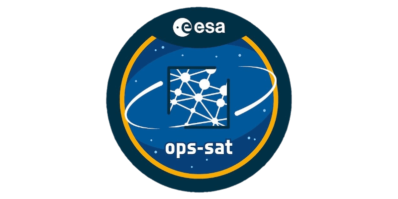

<p align="center">
  
</p>

# Generative AI Onboard the OPS-SAT-1 Spacecraft!
Using Generative AI to reconstruct corrupted images of Earth onboard the European Space Agency's [OPS-SAT-1](https://opssat1.esoc.esa.int/) spacecraft:
- **On September 29, 2023, the OPS-SAT-1 mission achieved a significant milestone when it successfully captured, noised, and subsequently denoised two images using WGANs, marking the pioneering first application of Generative AI in space.**
- This repository serves as the WGANs source code Git submodule to the experiments's parent repo: [georgeslabreche/opssat-onboard-image-denoiser](https://github.com/georgeslabreche/opssat-onboard-image-denoiser).
- Refer to the [parent repo](https://github.com/georgeslabreche/opssat-onboard-image-denoiser) for results and experiment artifacts downlinked from the spacecraft.


## Results
The restored images have remarkably high structural similarity indices of 0.89 and 0.92---where 1 would indicate that they are identical to their original images.

<div style="text-align:center;">
  <table align="center">
    <tr>
      <td></td>
      <td></td>
      <td></td>
    </tr>
    <tr>
      <td>(a) Original.</td>
      <td>(b) Noised.</td>
      <td>(c) Denoised.</td>
    </tr>
    <tr>
      <td></td>
      <td></td>
      <td></td>
    </tr>
    <tr>
      <td>(d) Original.</td>
      <td>(e) Noised.</td>
      <td>(f) Denoised.</td>
    </tr>
  </table>
</div>

**Figure 1: Fixed-Pattern Noise (FPN) factor 50 noising and WGANs Generative AI denoising onboard the spacecraft. Images are post-processed with color equalize.**


## Citation
We appreciate citations to our upcoming peer-reviewed IEEE publication. Thank you!

### BibTex
```BibTex
@inproceedings{ieee_aeroconf_labreche2024,
  title     = {{Generative AI... in Space! Adversarial Networks to Denoise Images Onboard the OPS-SAT-1 Spacecraft}},
  author    = {Labrèche, Georges and Guzman, Cesar and Bammens, Sam},
  booktitle = {{2024 IEEE Aerospace Conference}},
  year      = {2024}
}
```

### APA
Labrèche, G., Guzman, C., & Bammens, S. (2024). Generative AI... in Space! Adversarial Networks to Denoise Images Onboard the OPS-SAT-1 Spacecraft. *2024 IEEE Aerospace Conference*.

## Acknowledgements
The authors would like to thank the OPS-SAT-1 Mission Control Team at ESA's European Space Operations Centre (ESOC) for their continued support in validating the experiment, especially Vladimir Zelenevskiy, Rodrigo Laurinovics, [Marcin Jasiukowicz](https://yasiu.pl/), and Adrian Calleja. Their persistence in scheduling and running the experiment onboard the spacecraft until sufficient data was acquired and downlinked was crucial to the success of this experiment. A special thank you to [Kevin Cheng](https://kevkcheng.info/) from [Subspace Signal](https://subspacesignal.com/) for granting and facilitating remote access to the GPU computing infrastructure used to train the models presented in this work.

## Space Cadets
About the experimenters!

### Georges Labrèche
[Georges](https://georges.fyi) enjoys running marathons and running experiments on the OPS-SAT-1 Space Lab. Through his work, he has established himself as a leading figure in applied artificial intelligence for in-orbit machine learning in onboard spacecraft autonomy. He lives in Queens, NY, and supports the OPS-SAT-1 mission through his Estonian-based consultancy [Tanagra Space](https://tanagraspace.com/). Georges received his B.S. in Software Engineering from the University of Ottawa, Canada, M.A. in International Affairs from the New School University in New York, NY, and M.S. in Spacecraft Design from Luleå University of Technology in Kiruna, Sweden.

### César Guzman
César is an interdisciplinary R&D engineer with a background in reactive planning, plan execution and monitoring, space systems engineering, and machine learning. Cesar holds a Ph.D. in AI. He enjoys developing machine learning experiments on the OPS-SAT-1 Space Lab. In 2012, He collaborated with NASA Ames Research Center and is an R&D partner at the Estonian-based consultancy [Tanagra Space](https://tanagraspace.com/).

### Sam Bammens
A distinguished graduate with an M.S. degree in electronics and computer engineering technology from Hasselt University and KU Leuven in 2021, has a compelling background. He embarked on his career journey with ESA. During his initial two years, Sam served as a Young Graduate Trainee on the mission control team of OPS-SAT, showcasing his expertise. Presently, he holds the role of Spacecraft Operations Engineer within ESA's ESOC interplanetary department. He's a vital part of the flight control team dedicated to ESA's Solar Orbiter mission, solidifying his presence in the realm of space exploration.

## Todo
This repo is still a bit messy. There's some cleanup todo before it can be easily re-used:
1. Script and instructions to fetch the training data.
2. Instructions on how to install and run the training.
3. Refactor training data file paths.

<p align="center">
  
</p>

